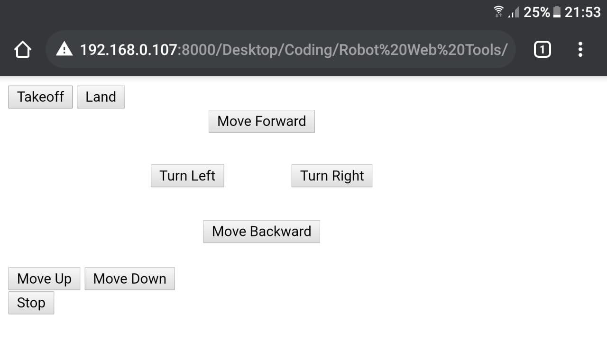
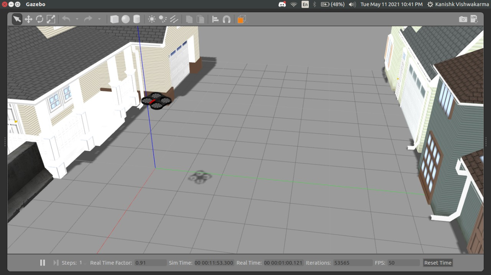

# Robot_Web_Tools
Web-based controller for AR-Drone, made using ROSLIBJS. I can now control the robot using my phone, by opening a webserver on my Ubuntu PC and opening this webpage on phone.
 
This is the controller, opened in my phone. 

This is the robot in my PC, being controlled remotely by my phone. 

